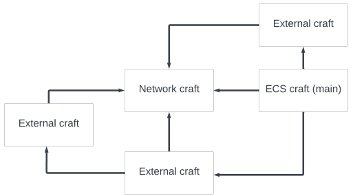
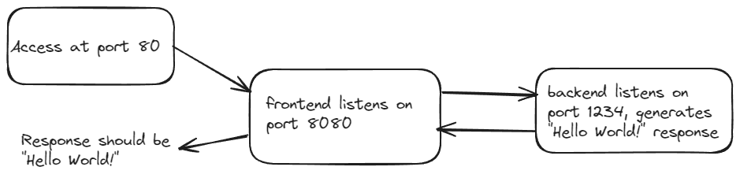

# infractl
A command line utility to provision and deploy docker-compose files in the cloud using Terraform as the deployment tool.  
Currently limited to deploying to AWS, ECS (Fargate services) and lambdas.  
<!-- TOC -->
* [infractl](#infractl)
    * [Build From Source](#build-from-source)
    * [Installation Of Needed Tools](#installation-of-needed-tools)
    * [Crafts](#crafts)
    * [Commands](#commands)
      * [Deploy commands](#deploy-commands)
      * [Control commands](#control-commands)
    * [Simple Hello World Example](#simple-hello-world-example)
    * [Hello World Deploy From Docker Compose](#hello-world-deploy-from-docker-compose)
      * [Local Run](#local-run)
      * [ECS Deployment](#ecs-deployment)
      * [One Craft Only](#one-craft-only)
      * [With External](#with-external)
    * [Lambda Crafts](#lambda-crafts)
    * [Remote State](#remote-state)
    * [Notes and Tips](#notes-and-tips)
<!-- TOC -->
### Build From Source
Golang needs to be installed on your system. In the source root folder do `go build .`  
This will create the executable in the same folder. You can then copy it to a folder in your path for later use.  

### Installation Of Needed Tools
You need to have Docker and Terraform. If you are using docker compose, you already have Docker.  
For Terraform, follow instructions from the web for your platform.  
Tested with the following versions, but more recent versions will work as well:
* Docker: 24.0.6
* Terraform: 1.5.6

### Crafts
The deployment is based on docker compose files, but craft files are needed to guide the deployment.  
The craft files are YAML configuration files.  
The templates are called recipes (in folder `recipes/std`). Once you have created a project, you can copy the recipes you need to the `crafts` folder and modify them for your project.  
Craft are of two types: `ecs` and `network`.  
The purpose of network crafts is reuse of network resources (VPC, subnets, etc.) between projects.  
`ecs` crafts refer to docker compose file(s) that are used to build and deploy the services. The names of the services in docker compose must match the name of services in the craft file.  
`ecs` crafts can also include other `ecs` crafts, for cases that one wants to deploy together code from separate repos and allow them to refer to each other. This is done with the `externals` section of the craft.  
One can generate environment variables that refer to the endpoint of an external with this syntax:
```text
external.<external name>.<service name>
```
`external name` is the name of the external in the craft file and `service name` is the name of the service in the docker compose file.  
Craft files have a  `Credentials` section that specifies the AWS credentials to use for deployment. It is optional. Credentials can be specified in the `infra_env_file` of the craft or as existing environment variables.  
The credentials needed are:
* `AWS_ACCESS_KEY_ID`
* `AWS_SECRET_ACCESS_KEY`
* `AWS_DEFAULT_REGION`  
Service environment variables can be specified in the docker compose file, in craft environment files (`compose_env_files`) or as inline values and files in the `services` section of the craft.

The simplest setup is like below:  


Crafts can be arranged in graphs if using externals.  
This is useful when the components have different and separate docker compose files and perhaps different repos.  
Usually all the crafts refer to the same network craft, but this is not mandatory.  

See examples of crafts in the example section below and files in the examples folder.  

### Commands
There are two sets of commands. One is for deploying to AWS from docker compose files and crafts (see about crafts below). The other is for viewing info about existing deployments.  

#### Deploy commands
The idea is that the same docker compose file used for local debugging can then easily be deployed to the cloud (AWS).
```text
infractl init [<root folder for generated infractl file structure, defaults to current folder>]
infractl deploy [<root folder>] <craft name> [--force-rebuild]
infractl destroy [<root folder>] <craft name>
```
* `init`: creates the folder structure for the project. You should do this once per project.
* `deploy`: deploys the project to AWS. It is based on the craft file that you specify. More on crafts below. This can be done multiple times if the craft file or the source code in the project chages.
* `destroy`: destroys the project in AWS. All AWS resource previously created will be deleted.

#### Control commands
```text
infractl list-clusters [[<root folder>] <craft name>]
infractl list-services [<root folder>] <craft name>
infractl outputs [<root folder>] <craft name>
infractl estimate-cost [[<root folder>] <craft name>]
```
`wstimate-cost` needs special admin privileges.  

### Simple Hello World Example
The folder `examples/hello-world` contains a very simple docker compose based project in Go with a frontend and backend.  
This example is intentionally very simple to illustrate two services communicating and to have small size Docker images.  
  

Note that the frontend is not a webpage, just a REST application.

### Hello World Deploy From Docker Compose
#### Local Run
In the examples folder do
```bash
docker compose up -d
curl localhost
```
You should see
```text
Received backend data: Hello World!
```
Request went to frontend, which got the response from backend and sent it back.

#### ECS Deployment
When starting a new project do `infractl init`. This will create the folder structure to be used by the other commands.  
It is assumed that you have an AWS account. The account used for deployment needs to have extensive permissions.  
As a first step, probably easiest to create a IAM user with AdministratorAccess role.  
Then use the credentials for that user. 
Copy the two crafts from the examples folder to the `crafts` folder under the root folder.
Edit the craft for desired values (credentials, network settings). 
The craft file name and the `staging` parameter are used to generate the deployed services names.  
The craft in the example has a domain name for the frontend. You need to change this for a domain name that you own. Or remove it.  
Run the `deploy` as shown above.
If successful, you should see output with the endpoint of the frontend service.  Either the domain name you specified or the AWS load balancer DNS name.

You can then type:
```text
 curl <output from deploy>
```
and you should see the same text as when run locally.  
If you run `deploy` again, nothing will happen.   
If you modify the source code and run `deploy` again, the new code will be deployed.  

#### One Craft Only
docker compose file:  
```yaml
services:
  backend:
    build:
      context: back
    ports:
      - 1234

  frontend:
    build:
      context: front
    environment:
      - BACKEND_HOST=backend
    ports:
      - 80:8080
    depends_on:
      - backend

```
ecs craft (hello-world.yml):  
```yaml
craft:
  recipe_version: 0.1.0
  type: ecs
  infra_env_file: ...enter path here
  docker_compose_files: ["src/docker-compose.yml"]
  network_craft_file: net.yml # if relative then to the location of this file

simple_ecs:
  type: fargate  # fargate or EC2
  # machine_type: t4g.micro  # required if type=EC2

  services:
    frontend:  # this should match the service name from docker-compose.yml
      desired_nodes: 1  # required
      cpu: 2  # required if type=fargate, in vCPU units
      memory: 1000  # required if type=fargate, in MiB units

      domain_name: hello.infracraft.dev  # optional, enables DNS record creation and certificate if load_balancer_port is 443
      load_balancer_http:
        - 80:8080
      load_balancer_https:
        - 443:8080

```
Note that only the `frontend` service appears in the craft. The `backend` service does not. It will have the values from docker compose file.  
network craft:  
```yaml
craft:
  recipe_version: 0.1.0
  type: network
  craft_name: basic

network:
  cluster_name: t3
  vpc_cidr: 10.0.0.0/16
```
#### With External
Same example, but the services shown as separate crafts. The frontend refers to the backend via the "externals" mecahnism.  
frontend docker compose file:  
```yaml
services:
  frontend:
    build:
      context: front
    ports:
      - 80:8080
```
backend docker compose file:
```yaml
services:
  backend:
    build:
      context: back
    ports:
      - 1234
```
main craft (frontend.yml):  
```yaml
craft:
  recipe_version: 0.1.0
  type: ecs
  docker_compose_files: ["src/docker-compose-frontend.yml"]
  network_craft_file: net.yml # optional, if relative then to the location of this file

simple_ecs:
  type: fargate  # fargate or EC2

  services:
    frontend:  # this should match the service name from docker-compose.yml
      desired_nodes: 1  # required
      cpu: 2  # required if type=fargate, in vCPU units
      memory: 1000  # required if type=fargate, in MiB units
      environment:
        BACKEND_HOST: externals.backend.backend

      domain_name: hello.infracraft.dev  # optional, enables DNS record creation and certificate if load_balancer_port is 443
      load_balancer_http:
        - 80:8080
      load_balancer_https:
        - 443:8080

externals:
  - name: backend
    craft_file: backend.yml # if relative, then to the location of this file
```
backend craft (backend.yml):  
```yaml
craft:
  recipe_version: 0.1.0
  type: ecs
  docker_compose_files: ["src/docker-compose-backend.yml"]
  network_craft_file: net.yml # optional, if relative then to the location of this file

simple_ecs:
  type: fargate  # fargate or EC2
```
network craft remains the same.  
To deploy use `infracraft deploy frontend`. This will deploy the network, frontend and backend.  

### Lambda Crafts
Lambda crafts deploy AWS lambdas with triggers. There are predefined triggers to use. More will be added as needed.  
The format is shown below.  
```yaml
craft:
  recipe_version: 0.1.0
  type: lambda
  infra_env_file: enter-name-here	# infrastructure related environment, such as AWS credentials
  network_craft_file: enter-name-here # if relative then to the location of this file

simple_lambda:
  function_name: ...
  handler: your_handler_function_name, should have signature func(event, context)
  runtime: python3.8 # to match your code, can be any runtime supported by AWS
  source_folder: ... # if relative then to the parent of infracraft root
  memory_size: 1024  # MiB units
  timeout: 30  # seconds
  ephemeral_storage: 1000 # Optional MiB units
  layers: [] # optional, ARNs of Lambda layers
  triggers: # At least one of triggers is required
	  schedule_expression: rate(1 day) # or cron(0 20 * * ? *) for 8pm UTC 
	  s3_object_created: bucket-name
  # environment:  # optional
  #  PARAMETER_KEY: PARAMETER_VALUE
  # env_files: [".env"] # optional, if relative then to the parent of infracraft root

credentials: # optional
  # Enter values here (optional). If missing, taken from infra_env_file
  AWS_ACCESS_KEY_ID: ...
  AWS_SECRET_ACCESS_KEY: ...
  AWS_DEFAULT_REGION: ...

```
### Remote State
Since Terraform is used for deployment, it is possible to use a remote state so that several people can work on the same project.  
The remote state is based on S3 and DynamoDB.
The S3 bucket and DynamoDB table should be created manually and they should have the same name.  
To use remote state with infractl, use the `backend` flag to the `deploy` command.  
The syntax is `infractl deploy <craft name> --backend <s3 bucket name>/<key>`.
`key` can be anything, but it is recommended to be in the form of `<organization>/<project>`.  
So, it could be like `my-bucket/google/crawler`.  
The AWS credentials to access the S3 bucket and DynamoDB table should be in the environment, `AWS_ACCESS_KEY_ID`, `AWS_SECRET_ACCESS_KEY`, `AWS_DEFAULT_REGION`.  
They can be different from the credentials used for the deployment (a different AWS account).  

### Notes and Tips
Environment files specified in the docker compose file are ignored, because they will not be present if the deploy is done in the cloud.  
When a compose file contains more than one service they usually connects via environment variables that have the value of the service name.
Infractl will replace these with the actual endpoint of the service. So it is important the other environment variables don't have the same value. If a conflict occurs, please rename the service and change the value of the environment variable  
  
There is no concept of a staging environment (like dev, stating, prod). It is recommended, but not mandatory, to encode the stage in the craft name. Like `frontend-dev.yml`.  
When using `destroy` on a non-network craft, the associated network craft will NOT be destroyed, since it may be used by other crafts. You need to explicitly destroy the network craft.  
